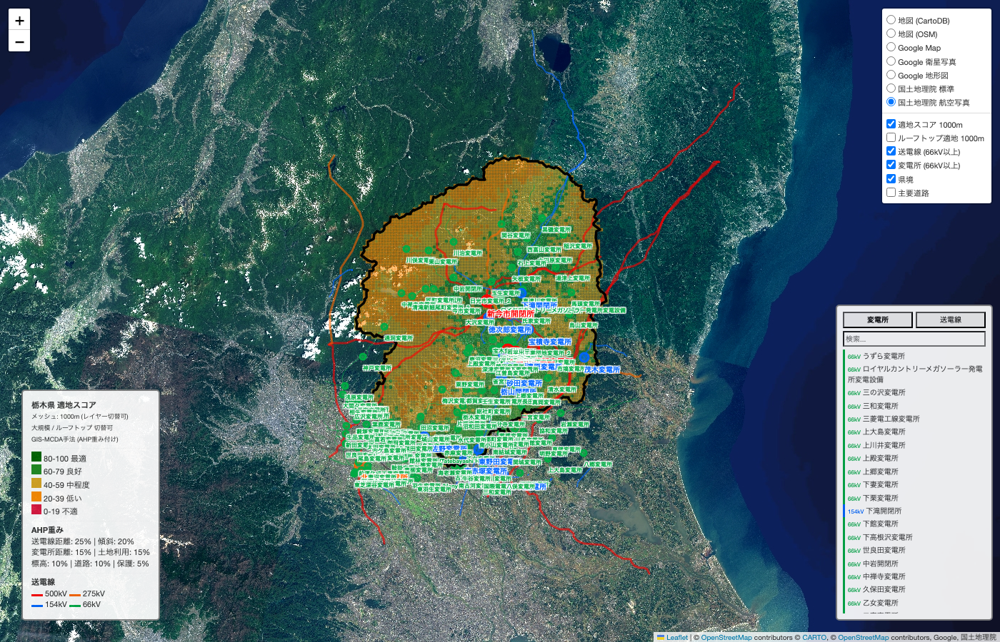
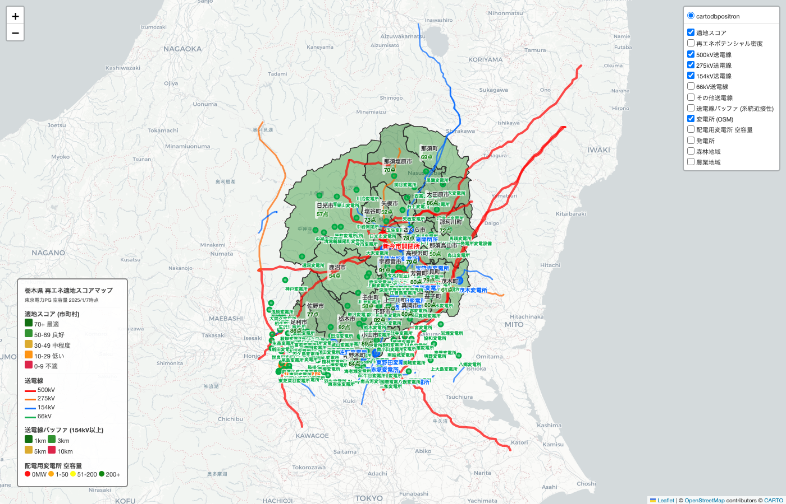
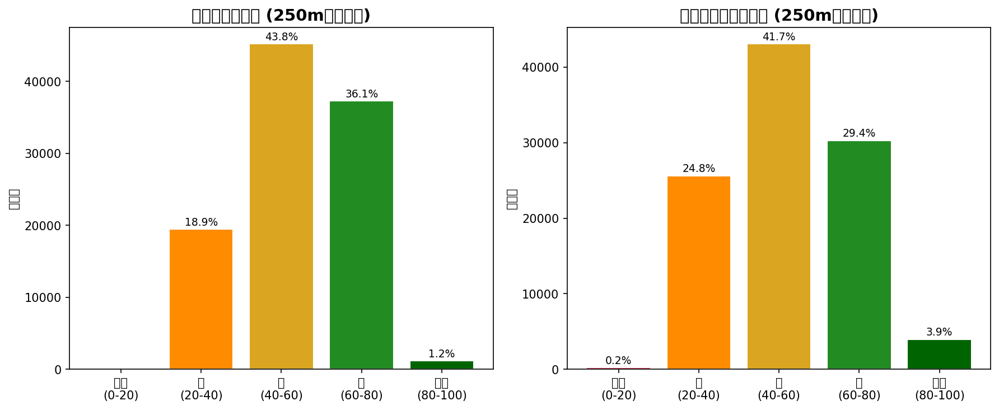
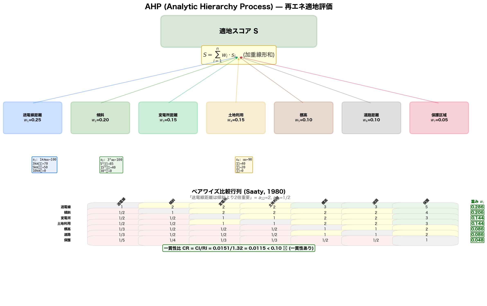
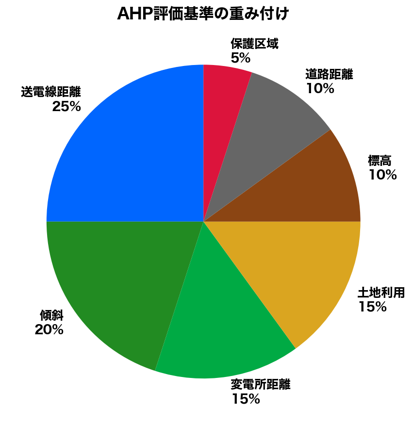
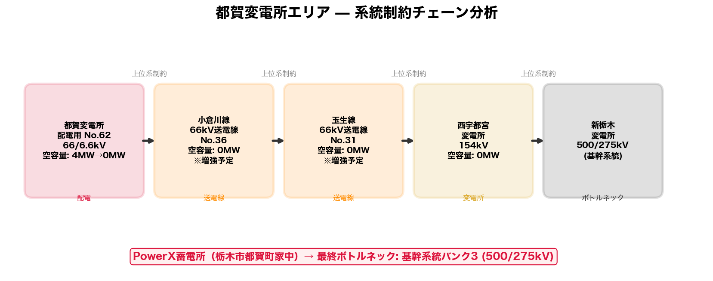

# kanto-re-potential

関東圏（栃木・千葉・茨城）の再エネポテンシャル推定・適地評価・系統空容量統合ツール

**[Live Demo (GitHub Pages)](https://lutelute.github.io/kanto-re-potential/index.html)**

## 概要

GIS-MCDA (AHP) 手法により、栃木県における再生可能エネルギーの適地評価を実施。
送電線距離・傾斜・土地利用・変電所距離・標高等の多基準を重み付けし、
250m/500m/1kmメッシュで適地スコアを算出する。

大規模地上設置とルーフトップ太陽光の2モードに対応。

### マップ





### スコア分布



## AHP評価基準

### 階層構造



### 重み付け



| 基準 | 重み | データソース |
|---|---|---|
| 送電線(154kV以上)距離 | **25%** | [All-Japan-Grid](https://github.com/lutelute/All-Japan-Grid) |
| 傾斜 | **20%** | SRTM DEM 30m |
| 変電所(66kV以上)距離 | **15%** | All-Japan-Grid |
| 土地利用 | **15%** | 国土数値情報 100mメッシュ |
| 標高 | **10%** | SRTM DEM |
| 道路距離 | 10% | OSM |
| 保護区域 | 5% | 国土数値情報 |

### 土地利用スコア (大規模 vs ルーフトップ)

| 土地利用 | 大規模 | ルーフトップ |
|---|---|---|
| 荒地 | **90** (最適) | 10 |
| ゴルフ場等 | 85 | 10 |
| その他用地 | 80 | 30 |
| 田・農用地 | 40 | 10 |
| 森林 | 20 | 0 |
| **建物用地** | **0** (不適) | **85** (最適) |
| 道路・鉄道・河川 | 0 | 0 |

## 都賀変電所 制約チェーン分析



## データソース

| レイヤー | データソース | 形式 |
|---|---|---|
| 送電線・変電所 (169箇所, 486本) | [All-Japan-Grid](https://github.com/lutelute/All-Japan-Grid) (OSM由来) | GeoJSON |
| 系統空容量 | 東京電力PG 空容量マッピング (2025/1/7時点) | CSV |
| 土地利用 100mメッシュ | 国土数値情報 L03-b | GeoTIFF |
| 傾斜 30m | SRTM DEM (NASA) | HGT |
| 森林地域 | 国土数値情報 A13 | Shapefile |
| 農業地域 | 国土数値情報 A12 | Shapefile |
| 行政区域 | 国土数値情報 N03 | Shapefile |
| 主要道路 (12,204本) | OpenStreetMap Overpass API | GeoJSON |
| 再エネポテンシャル | 環境省REPOS推計 | CSV |

## 使い方

```bash
# 依存関係
pip install geopandas shapely folium pandas numpy rasterio requests pandapower

# 1. 系統データ抽出 (All-Japan-Grid → 栃木県)
python src/extract_tochigi_grid.py

# 2. 土地利用・DEMデータダウンロード
python src/download_land_data.py
python src/slope_analysis.py

# 3. メッシュ適地評価 (全解像度・全モード)
python src/mesh_suitability.py
# → output/tochigi_mesh_multi_map.html

# 4. 単一解像度で実行
python src/mesh_suitability.py --resolution 250

# 5. 都賀変電所詳細分析
python src/tsuga_analysis.py

# 6. 潮流計算シミュレーション
python src/congestion_simulation.py
```

## マップレイヤー (切替可能)

- **適地スコア**: 1000m / 500m / 250m メッシュ (大規模)
- **ルーフトップ適地**: 1000m / 500m / 250m メッシュ
- **送電線**: 500kV / 275kV / 154kV / 66kV
- **変電所**: 66kV以上 全169箇所 (名前常時表示)
- **配電用変電所**: 空容量色分け (91箇所)
- **主要道路**: 高速・国道・県道
- **県境**: 太黒線
- **背景**: CartoDB / OSM / Google Map / Google衛星 / Google地形 / 国土地理院 / 航空写真

## ディレクトリ構成

```
src/
  mesh_suitability.py         # メッシュ適地評価 (メイン)
  build_integrated_map.py     # 統合マップ生成
  extract_tochigi_grid.py     # 系統データ抽出
  download_land_data.py       # GISデータDL
  slope_analysis.py           # DEM傾斜解析
  tsuga_analysis.py           # 都賀変電所分析
  congestion_simulation.py    # pandapower潮流計算
  build_potential_layer.py    # REPOSポテンシャル
  build_map.py                # 基本マップ
data/
  grid/                       # 空容量CSV + 変電所・送電線リスト
  potential/                  # REPOSポテンシャルCSV
  land/                       # GISデータ (gitignore, 要DL)
output/                       # 分析レポート (Markdown)
docs/                         # GitHub Pages
```

## 関連プロジェクト

- [All-Japan-Grid](https://github.com/lutelute/All-Japan-Grid) - 全国電力系統GISデータ
- [all-japan-traffic-grid](https://github.com/lutelute/all-japan-traffic-grid) - 交通ネットワーク

## 参考文献

- Al Garni & Awasthi (2017), Applied Energy - GIS-AHP solar site selection
- Doorga et al. (2019), Renewable Energy - Multi-criteria GIS solar farm modelling
- Shorabeh et al. (2019), Renewable Energy - Risk-based MCDA for solar in Iran
